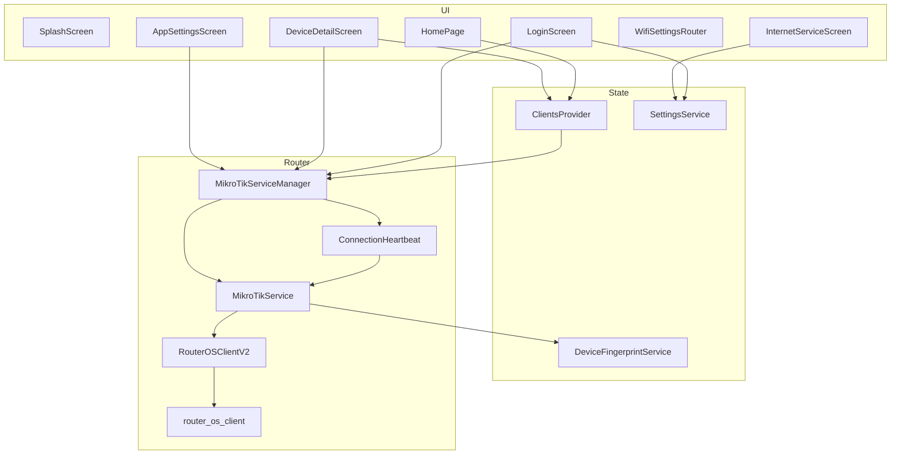
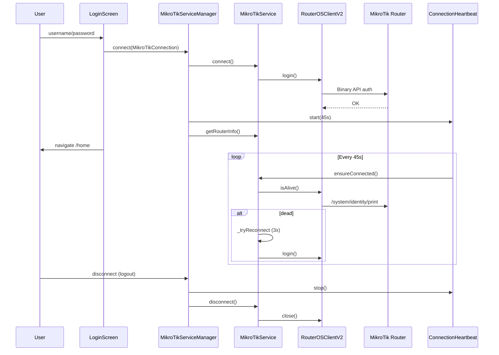

# ??????? ???? ????? Jahan Bit (???? ???)

> **???? ??????:** 1.0.0+1  
> **???????????:** Mersad Karimi  
> **??????:** Flutter (Dart SDK ^3.10.4)  
> **???:** ?????? ???? MikroTik RouterOS — ?????? ?????????? ????? ?????????? ??????? ????? ??? ????? ????? ? ?????? ISP

---

## ????? ?????

1. [????? ? ?????????](#1-?????-?-?????????)
2. [?????? ?????](#2-??????-?????)
3. [?????? ???](#3-??????-???)
4. [????? ?? MikroTik](#4-?????-??-mikrotik)
5. [???? RouterOS Client](#5-????-routeros-client)
6. [????????](#6-????????)
7. [??????? ????](#7-???????-????)
8. [?????? State (Provider)](#8-??????-state-provider)
9. [???? ?????? ? ?????](#9-????-??????-?-?????)
10. [?????? RouterOS ? ???? ????????](#10-??????-routeros-?-????-????????)
11. [??????? ?????? (WiFi Settings)](#11-???????-??????-wifi-settings)
12. [?????????? ????](#12-??????????-????)
13. [??????????? ?????](#13-???????????-?????)
14. [???? ?????????? ? ??????????](#14-????-??????????-?-??????????)

---

## 1. ????? ? ?????????

**Jahan Bit** ?? ???????? ??????/?????? Flutter ??? ?? ?? ???? **RouterOS API** (???? ???? ?? SSL ??? ????) ?? ???? MikroTik ???? ?????? ? ?????? ?????? ???? ?? ????? ??????.

### ?????????? ????

| ?????? | ????? |
|--------|--------|
| ???? ?? ???? | ??? ??????/??? + host/port/ssl ?? ??????? |
| ???? ?????????? ???? | ???????? ?????? (Progressive Load): Phase 1 ??? DHCP? ??? ??? CPE ???? ????? wireless |
| ????? / ??? ????? | Firewall Raw + DHCP block + Wireless access-list |
| ????? / ?? ?????? ???? | ????? lease ?? static ?? ban |
| ??????? ???? | `rate-limit` ??? DHCP lease |
| ??? ????? ???? | DHCP pool ? `static-only` |
| ??? ?????? ?????? | ?????? `comment` ??? lease |
| ??????? ?????? | ??? native API ?? WebView ??? CPE ?? ???? board/model |
| ?????? ISP | WebView ????? (?? ????? ??????) |
| Auto-login | ?????????? ????????? + Splash |
| ?? ????? | ????? (???????) ? ??????? |
| ?? | ???? / ????? / ????? |

---

## 2. ?????? ?????

```
internet_management/
+-- lib/
¦   +-- main.dart                 # ???? ????? MyApp? MainScaffold? HomePage
¦   +-- models/
¦   ¦   +-- mikrotik_connection.dart
¦   ¦   +-- client_info.dart
¦   ¦   +-- device_fingerprint.dart
¦   +-- services/
¦   ¦   +-- mikrotik_service_manager.dart   # Singleton — ???????? session
¦   ¦   +-- mikrotik_service.dart           # ???? ???? RouterOS
¦   ¦   +-- routeros_client_v2.dart         # Wrapper ???? router_os_client
¦   ¦   +-- routeros_client.dart          # ?????????? legacy (??????? ???????)
¦   ¦   +-- connection_heartbeat.dart       # ???????? ?????
¦   ¦   +-- settings_service.dart
¦   ¦   +-- device_fingerprint_service.dart
¦   ¦   +-- network_info_service.dart
¦   +-- providers/
¦   ¦   +-- clients_provider.dart           # State ?????????
¦   +-- screens/
¦   ¦   +-- login_screen.dart
¦   ¦   +-- device_detail_screen.dart
¦   ¦   +-- internet_service_screen.dart
¦   ¦   +-- wifi_settings_screen.dart       # WifiSettingsRouter + ??? native
¦   ¦   +-- app_settings_screen.dart
¦   ¦   +-- settings_screen.dart            # (?? routes ??? ????)
¦   ¦   +-- connection_test_screen.dart     # ??? dev
¦   +-- utils/
¦       +-- app_localizations.dart
¦       +-- wifi_webview_boards.dart        # ??????? ? ??? CPE ? WebView
¦       +-- wifi_panel_url_resolver.dart    # URL ???? ???: http://10.10.10.2/
¦       +-- client_display_policy.dart      # ????? ???? DHCP / ???? IP
+-- assets/                       # ???? Vazir? ????
+-- android/, ios/, windows/, linux/, macos/, web/
+-- pubspec.yaml
```

---

## 3. ?????? ???

### 3.1 ?????????

```
+-------------------------------------------------------------+
¦  UI Layer                                                    ¦
¦  LoginScreen | HomePage | DeviceDetail | WebView | WiFiSettings | Settings ¦
+-------------------------------------------------------------+
                            ¦ Provider.of / Navigator
+---------------------------?---------------------------------+
¦  State Layer                                                 ¦
¦  ClientsProvider (ChangeNotifier)                            ¦
+-------------------------------------------------------------+
                            ¦
+---------------------------?---------------------------------+
¦  Session Layer (Singleton)                                   ¦
¦  MikroTikServiceManager + ConnectionHeartbeat                ¦
+-------------------------------------------------------------+
                            ¦
+---------------------------?---------------------------------+
¦  Business / API Layer                                        ¦
¦  MikroTikService (_talk, ban, clients, DHCP, ...)           ¦
+-------------------------------------------------------------+
                            ¦
+---------------------------?---------------------------------+
¦  Transport Layer                                             ¦
¦  RouterOSClientV2 ? package:router_os_client                  ¦
¦  TCP 8728 / SSL 8729 — Binary API v6                         ¦
+-------------------------------------------------------------+
```

### 3.2 ?????? ????? ????



### 3.3 ??????? ?????

| ???? | ??? ??????? |
|------|-------------|
| **Singleton** | `MikroTikServiceManager`, `SettingsService`, `NetworkInfoService`, `DeviceFingerprintService` |
| **Provider / ChangeNotifier** | `ClientsProvider` ???? ???? ????????? |
| **Facade** | `MikroTikServiceManager` ??? `MikroTikService` |
| **Command Queue** | `RouterOSClientV2._commandQueue` — ?????????? `talk()` |
| **Marker ?? comment** | `[JahanBit BAN]`, `[JahanBit STATIC]` ??? lease ? firewall |

---

## 4. ????? ?? MikroTik

### 4.1 ??? ????? — `MikroTikConnection`

```dart
MikroTikConnection(
  host: '192.168.88.1',
  port: 8728,              // ???????
  username: 'admin',
  password: '***',
  useSsl: false,
)
```

- ??? `useSsl == true` ? `port == 8728` ? ???? ????? **8729** (`actualPort` getter).

### 4.2 ?????? ??????? ????? (Login)

```
????? ? LoginScreen._handleLogin()
  ¦
  +- SettingsService.getAllSettings()  ? host, port, useSsl
  +- MikroTikConnection(...)
  ¦
  +- MikroTikServiceManager.connect(connection)
        ¦
        +- disconnect()                    // ???? session ????
        +- new MikroTikService()
        +- MikroTikService.connect()
        ¦     +- _lastConnection = connection
        ¦     +- RouterOSClientV2.login()  ? ???? router_os_client
        +- getRouterInfo()                 // cache ?? manager
        +- ConnectionHeartbeat.start()     // ?? 45 ?????
  ¦
  +- SettingsService.setLoginTimestamp()
  +- Navigator ? /home
```

**????? ?????? Host ?? ?????:**  
`LoginScreen._autoSetRouterHostFromGateway()` ?? `NetworkInfoService.getDefaultGatewayOrRouterIp()` ??????? ?????? ? `SettingsService.setHost(gateway)` ?? ??????.

### 4.3 ???????? ????? (Heartbeat)

????: `lib/services/connection_heartbeat.dart`

| ??????? | ????? |
|---------|--------|
| ???? ??????? | 45 ????? |
| healthCheck | `MikroTikService.ensureConnected()` |
| reconnect | ???? `ensureConnected()` (???? ????? reconnect ????? ????? ??????) |
| ???????? | ????? ????? ?????? |
| ?????? ?? foreground | ??? ?? 1 ????? ?? tick + ?????????? ???? periodic |

### 4.4 ???? `ensureConnected` ? Reconnect

?? `MikroTikService`:

1. ??? `_lastConnection == null` ? `false`
2. ??? client ???? ????? ? `_tryReconnect()`
3. `client.isAlive(timeout: 3s)` — ????? `/system/identity/print`
4. ??? ???? ??? ? `_tryReconnect()`

**`_tryReconnect`:**
- ?????? **3 ????**
- ?????: 500ms × ????? ???? (???? 2 ? 1000ms? ???? 3 ? 1500ms)
- `_reconnectInProgress` ?? reconnect ????? ??????? ??????
- ?????????? ?? `_lastConnection` (????? connect ????)? ?? ?? UI

**`_talk` (?? ????? API):**
- ????? `ensureConnected()`
- timeout ???????: **10 ?????**
- ?? `TimeoutException` ? `client.invalidateConnection()`

### 4.5 ??? ?????

| ?????? | ??? |
|--------|-----|
| Logout | `ClientsProvider.clear()`, `disconnect()`, `clearLoginTimestamp()` |
| ?????? 14 ??? | `MainScaffold._checkLoginExpiration` |
| `connect()` ???? | `disconnect()` ???? ??? ?? session ???? |

### 4.6 ????? ??? ???? ?????? ????

`MikroTikServiceManager.getClientSpeedIsolated(target)`:
- ?? `MikroTikService` **????** ???????
- connect ?? timeout 8s
- `getClientSpeed` ?? timeout 20s
- ?? `finally` ????? `disconnect()`

**????:** ?????? ???? ????? ?? ??????? ????? ???? ?? ????? ???.

---

## 5. ???? RouterOS Client

### 5.1 ???? ???? (Production)

`RouterOSClientV2` ? `package:router_os_client`

| ??? | ??? |
|-----|-----|
| `login()` | ???? `RouterOSClient` ? ????? ???? |
| `talk(command)` | ????? ?????? **??? ?? ?? `_commandQueue`** |
| `isAlive()` | `/system/identity/print` ?? timeout |
| `invalidateConnection()` / `close()` | `_resetState()` — ???? socket ? ??? ???? ?? |
| `isConnected` | `_loggedIn && _client != null` |

**??? ?? ??????**  
Socket RouterOS API ?????? ???? ?? `talk()` ??????? ??????? ?? ???? ?????? ? ?? timeout ???? ???????.

### 5.2 ???? Legacy (???????)

`lib/services/routeros_client.dart` — ?????????? ???? Binary API v6 + MD5 challenge.  
**??? import ????? ?? `MikroTikService` ?? ??? ???? ????.**  
??? `ConnectionTestScreen` ???????? ?????? `MikroTikService` ????? (???? ???? v2).

### 5.3 ???? ????? API

??????? ?? ???? ???? ???? (????? CLI RouterOS):

```dart
[
  '/ip/dhcp-server/lease/print',
  '?=address=192.168.1.10',
  '=.proplist=address,mac-address,comment,dynamic',
]
```

---

## 6. ????????

### 6.1 `MikroTikServiceManager` (Singleton)

**????:** `lib/services/mikrotik_service_manager.dart`

| State | ??? |
|-------|-----|
| `_service` | `MikroTikService?` |
| `_currentConnection` | `MikroTikConnection?` |
| `_routerInfo` | `Map<String, dynamic>?` |
| `_heartbeat` | `ConnectionHeartbeat?` |

**API ????? (delegate ?? service):**  
`connect`, `disconnect`, `autoConnect`, `getRouterInfo`, `loadSecondaryDataIsolated`, `getAllClients`, `getConnectedClients`, `getBannedClients`, `getPhase1BoundDhcpLeases`, `getPhase2ManagedBanRawRules`, `getPhase2ArpTable`, `getPhase2WirelessRegistrations`, `getDeviceIp`, `getDefaultGateway`, `makeClientStatic`, `lockNewConnections`, `unlockNewConnections`, `isNewConnectionsLocked`, `setDhcpLeaseDisplayName`, `getClientSpeedIsolated`, `getWifiSettings`, `setWifiSsid`, `setWifiPassword`, `beginProgressiveLoad`, `endProgressiveLoad`, `ensureSession`

---

### 6.2 `MikroTikService` (???? ????)

**????:** `lib/services/mikrotik_service.dart` (~2400+ ??)

#### ???????? ???

```dart
static const String _appPrefix = 'JahanBit';
static const String _banMarker = '[JahanBit BAN]';
static const String _staticMarker = '[JahanBit STATIC]';
static const String _staticOnlyPool = 'static-only';
static const Duration _apiTimeout = Duration(seconds: 10);
```

#### ??????? ???? Wireless Access List (Ban/Unban)

???? board-name???? ??? LHG5? SXT ?... ?????? `_wirelessUnsupportedBoardKeys` — ?????? wireless ban/unban ?? access-list **???????** ??????. ??? ???? **?????** ?? ???? WebView ?????? ???.

#### ????? ?????? Wireless ?? API

`_supportsWirelessFeatures()`:
- ??? `_routerInfoCache` ????? ???? ? `wireless-features-enabled = !_isWirelessUnsupportedRouter(...)`
- ?? **Progressive Load** ? ???? cache ???? ? **`false`** (wireless ?????? ??????? ?? board ???? ???)
- ?? `ensureConnected` ????? progressive (???? force health check) ? health check ?? ?????? ?? ?? ??? ?????

#### ?????? WiFi (??? native)

| ??? | RouterOS |
|-----|----------|
| `getWifiSettings({interfaceId})` | `/interface/wireless/print` + `/interface/wireless/security-profiles/print` |
| `setWifiSsid(...)` | `/interface/wireless/set` — `ssid`, `hide-ssid` |
| `setWifiPassword(...)` | `/interface/wireless/security-profiles/set` — `wpa2-pre-shared-key` ? `wpa-pre-shared-key` |

??? ?????? **????** ?? SharedPreferences ????? ???????.

#### ?????? ????? (?????)

| ???? | ????? |
|------|--------|
| ????? | `connect`, `disconnect`, `ensureConnected`, `isConnected` |
| ????????? | `getAllClients`, `getClientsDetailed`, `getConnectedClients` |
| Ban/Unban | `banClient`, `unbanClient`, `banClientWithFingerprint`, `unbanClientWithFingerprint`, `getBannedClients` |
| ???? | `setClientSpeed`, `getClientSpeed`, `removeClientSpeed` (+ legacy aliases) |
| DHCP | `makeClientStatic`, `setDhcpLeaseDisplayName`, `lockNewConnections`, `unlockNewConnections`, `isNewConnectionsLocked` |
| ????/???? | `getDeviceIp`, `getDefaultGateway`, `getDefaultGatewayOrRouterIp`, `getRouterInfo`, `getRouterInfoSecondary`, `checkIp` |
| Progressive | `getPhase1BoundDhcpLeases`, `getPhase2ManagedBanRawRules`, `getPhase2ArpTable`, `getPhase2WirelessRegistrations` |
| WiFi | `getWifiSettings`, `setWifiSsid`, `setWifiPassword` |
| Fingerprint | `checkAndBanBannedDevices` (?? `_runBackgroundTasks` ?? Provider) |

---

### 6.3 `SettingsService` (Singleton)

**????:** `lib/services/settings_service.dart`  
**?????:** SharedPreferences + cache ?? ?????

| ???? | ??????? | ?????? |
|------|---------|--------|
| `mikrotik_host` | `192.168.88.1` | IP ???? |
| `mikrotik_port` | `8728` | ???? API |
| `mikrotik_use_ssl` | `false` | SSL |
| `internet_service_url` | `http://user.ariyabod.af/users` | WebView |
| `login_timestamp` | — | ?????? 14 ???? |
| `app_language` | `fa` | ???? |
| `app_theme_mode` | `system` | ?? |

---

### 6.4 `NetworkInfoService` (Singleton)

**????:** `lib/services/network_info_service.dart`

| ??? | ???? ???? |
|-----|-----------|
| `getDeviceIPv4Address()` | `NetworkInterface.list` — ????? IP ????? |
| `getDefaultGateway()` | RouterOS ??? ???? ???? |
| `getDefaultGatewayOrRouterIp()` | 1) RouterOS 2) ??? `x.y.z.1` 3) host ?? Settings |

---

### 6.5 `DeviceFingerprintService` (Singleton)

**????:** `lib/services/device_fingerprint_service.dart`  
**????:** `banned_device_fingerprints` (JSON ?? SharedPreferences)

| ??? | ??? |
|-----|-----|
| `saveBannedFingerprint` | ?????? ??? `matches` ?????? ????? |
| `removeBannedFingerprint` | ??? ??? ???????? |
| `getBannedFingerprints` | ???? |
| `isDeviceBanned` / `findBannedFingerprint` | ????? |

---

### 6.6 `ConnectionHeartbeat`

?????? ?? [??? 4.3](#43-???????-?????-heartbeat).

### 6.7 ???????? ???? (`lib/utils/`)

| ???? | ??? |
|------|-----|
| `app_localizations.dart` | i18n ?????/??????? |
| `wifi_webview_boards.dart` | ??????? ???? ? ??? CPE? `isWifiWebViewBoard()` |
| `wifi_panel_url_resolver.dart` | ???? `cpeWifiPanelUrl = http://10.10.10.2/` |
| `client_display_policy.dart` | ????? ??? DHCP+IP? skip wireless ??? CPE? ????? ?????? ???? IP |

---

## 7. ??????? ????

### 7.1 `ClientInfo`

**????:** `lib/models/client_info.dart`

???? ?? ?????? ??????? ?? ????? ?????:

| ???? | ???? |
|------|------|
| `type` | `hotspot`, `wireless`, `dhcp`, `ppp` |
| `source` | ????? `wireless_registration`, `dhcp_lease` |
| `ipAddress`, `macAddress`, `hostName` | ????????? ???? |
| `isStaticLease` | `true` = static? `false` = dynamic |
| `ssid`, `signalStrength` | wireless |
| `rawData` | Map ??? RouterOS |

`fromMap` / `toMap` ?? ??????? snake_case ???? API ?????.

---

### 7.2 `DeviceFingerprint`

**????:** `lib/models/device_fingerprint.dart`

??????? ?????? ?????? ?? ?? ????? IP/MAC:

| ??? | ?????? |
|-----|--------|
| hostname | ???????? |
| deviceType | ?? hostname (iPhone, Samsung, ...) |
| macVendor | 3 ???? ??? MAC |
| ssid | wireless |

- `fingerprintId` = join ?? `|`
- `matches(other)` — hostname ????? **??** (vendor + deviceType + ssid) ?????

---

### 7.3 ????????? Map (???? ???? ???)

**??????? ????** (`getRouterInfo`):
- `uptime`, `version`, `board-name`, `platform`, `wireless-features-enabled`, ...

**???? banned** (`getBannedClients`):
- `address`, `mac_address`, `chains`, `rule_ids`, `host_name`, `dhcp_blocked`, `wireless_blocked`

**???? ???? ??????:**
```json
{
  "status": "success",
  "total_count": 5,
  "clients": [ /* ClientInfo.toMap() */ ]
}
```

---

## 8. ?????? State (Provider)

### 8.1 `ClientsProvider`

**????:** `lib/providers/clients_provider.dart`  
**???:** `ChangeNotifierProvider` ?? `MyApp`

#### State

| ????? | ????? |
|-------|--------|
| `_clients` | ???? ???? (????? ??? ?? banned) |
| `_bannedClients` | ???? ????? |
| `_deviceIp` | IP ?????? ????? |
| `_routerInfo` | ??????? ???? |
| `_isNewConnectionsLocked` | ????? ??? DHCP |
| `_isLoading`, `_isRefreshing`, `_errorMessage` | UI |
| `_approvalActionsInProgress` | ??????? ?? ????? ???? ?????/?? |

#### Timeout??? ????????

| ?????? | Timeout |
|--------|---------|
| device IP | 10s |
| auto static | 10s |
| router info | 8s |
| lock status | 8s |
| banned list | 10s |
| connected clients | 12s |

#### ???????? ?????? — `_runProgressiveLoad()`

| Phase | ??? | ????? |
|-------|-----|--------|
| **1** | `_loadPhase1DeviceList` | ??? DHCP lease??? `bound` ? ???? ????? ???? |
| **2** | `_loadPhase2StatusEnrichment` | ?????? ban? ????? IP ?? ARP? wireless (?? ???? ????) |
| **3** | `_loadPhase3SecondaryData` | IP ??????? `routerInfo`? ????? ??? DHCP (????? isolated) |
| ???????? | `_runBackgroundTasks` | auto-static? `checkAndBanBannedDevices` |

?? Phase 2? `beginProgressiveLoad()` / `endProgressiveLoad()` ??? ????? ???? ??? ?? health check ????? ?? ?? ????? ????.

#### ????? ????? ???? — `ClientDisplayPolicy`

**????:** `lib/utils/client_display_policy.dart`

| ????? | ????? |
|-------|--------|
| `shouldShowInConnectedList` | ??? ?????? ?? **IP ?????** (?? `0.0.0.0` / ????) |
| `shouldSkipWirelessEnrichment` | ??? ??? CPE (??????? `wifi_webview_boards`) ?? `wireless-features-enabled == false` |
| `shouldAllowDeviceActions` | ban/????/??? DHCP ???? ?? IP ???? |

?????????? wireless ?? **??? MAC** (???? IP) — ????? ??? LHG/SXT — ?? ???? ????? ???? **????????**.

#### `initialize()` / `refresh()`

1. `_runProgressiveLoad()` — ???? ???? Home ?? ?? login
2. `refresh()` — dedupe ?? `_activeRefreshFuture`? ???????? `loadClients()` ???? (12s) ?? ?? ??? ????

#### ????????? ?????

1. ?????? ???? (IP ?????) ???
2. static ??? ?? dynamic
3. ??? ?? ???? IP

#### ?????? ?????

| ??? | ????? |
|-----|--------|
| `banClient` | fingerprint + fallback ban? ????? ???? ?????? ???? |
| `banClientInstant` | ??? ???? ?? UI + ban ?? ???????? |
| `unbanClient` | ?? ???? banned ??? + API |
| `approveDevice` | `makeClientStatic` + ????? static ?? UI |
| `rejectDevice` | static ??? ban |
| `toggleNewConnectionsLock` | lock/unlock pool |
| `updateClientLeaseDisplayName` | ??? ??? lease |
| `setClientSpeed` / `removeClientSpeed` | + cache ???? SharedPreferences |
| `clear()` | logout — ??? ???? state |

#### ?????? «?? ?????? ?????»

`isDevicePendingApproval`:
- ?? ?????? ????
- ?? static
- ????? IP ? (dynamic ?? MAC)

---

## 9. ???? ?????? ? ?????

### 9.1 ?????? (`main.dart` ? `MyApp`)

| Route | Widget |
|-------|--------|
| `/` | `SplashScreen` (auto-login) |
| `/login` | `LoginScreen` |
| `/home` | `MainScaffold` |
| `/test` | `ConnectionTestScreen` |
| `/device-detail` | `DeviceDetailScreen` (arguments) |
| `/wifi-settings` | `WifiSettingsRouter` |
| `/wifi-webview` | `InternetServiceScreen` — `fixedUrl: http://10.10.10.2/` |

### 9.2 `MyApp`

- ???????? ???? ? ?? ?? `SettingsService`
- `Provider<ClientsProvider>`
- `RouteObserver` ???? refresh ????? ?????? ?? detail
- ??? ???? ?? startup

### 9.3 `MainScaffold`

`IndexedStack` ?? ?? ??:
1. **HomePage** — ?????? ?????????
2. **InternetServiceScreen** — WebView
3. **AppSettingsScreen** — ????? ??? ????

????? ?????? ????? 14 ????.

### 9.4 `HomePage`

- ??? ????? (identity ????? ?????? SSL? IP ??????)
- ????? **??? ????? ????**
- ?????? Connected / Banned
- Pull-to-refresh
- ???? ??????: ???? static/dynamic? ?????/??? navigation ?? detail
- `RouteAware` — refresh ?? ?? pop ?? detail

### 9.5 `DeviceDetailScreen`

- ?????? ??? ?????? lease
- ??????? ???? (sheet) + `getClientSpeedIsolated`
- ban/unban (?? fingerprint)
- ????? ???? pending approval
- ??? `ClientDisplayPolicy.shouldAllowDeviceActions(device) == false` (???? IP): **???? ???? ???????** — ??? ???????

### 9.6 `InternetServiceScreen`

?? ????:
1. **?? ????? ??????** — URL ?? `SettingsService.getServiceUrl()` (??????? ?????? ISP)
2. **??? ?????? CPE** — route `/wifi-webview` ?? `fixedUrl` ???? `http://10.10.10.2/`

`InAppWebView` — navigation? reload? ????? URL ??? ???? `allowUrlChange: true`.

### 9.7 `wifi_settings_screen.dart`

| Widget | ??? |
|--------|-----|
| `WifiSettingsRouter` | ????? board ?? `ClientsProvider.routerInfo`? ???????? |
| `_WifiLoadingPlaceholder` | ?????? ?? `routerInfo` (?????? ?? ?????) + `loadRouterInfo()` |
| `WifiNativeSettingsScreen` | ??? SSID / ??? / Hide SSID ???? ??????? ???-CPE |
| `_WifiWebViewRedirect` | `pushReplacementNamed('/wifi-webview')` |

???? ?? **AppSettingsScreen** ? `Navigator.pushNamed('/wifi-settings')`.

### 9.8 `AppSettingsScreen`

- ????? ??? ????
- ???? **??????? ??????** ? `/wifi-settings`

### 9.9 `LoginScreen`

- ??? username/password (host ?? Settings + auto gateway)
- ????? ?? ???? Manager

### 9.10 ????? ?????????? / dev

- `SettingsScreen` — ?????? host/port/ssl (**?? routes ????**)
- `ConnectionTestScreen` — ??? ?????? `MikroTikService`

---

## 10. ?????? RouterOS ? ???? ????????

### 10.1 ???????? ?????????? ????

#### ???? Progressive (Home — ???????)

```
Phase 1: DHCP bound leases ???
Phase 2: ban flags + ARP IP fill + wireless (??? shouldSkipWirelessEnrichment == false)
Phase 3: routerInfo + deviceIp + lock
? ?????: banned + ClientDisplayPolicy (??? ?? IP)
```

#### ???? ????? — `getConnectedClients()`

```
1. DHCP leases (status=bound) ? dictionary ?? ???? MAC
2. ARP table ? ????? IP
3. Wireless registration-table (??? ??? _supportsWirelessFeatures)
   ? ???????? ???? IP ?? ???????
4. DHCP leases ?????????? (??? ?????? ?? wireless)
5. Hotspot active (??? ??????)
```

??? ??????: ?? `comment` lease (???? marker??? BAN/STATIC) ?? `host-name`.

---

### 10.2 ????????? — `banClient`

?? ???? (?? ???? ?? comment ?????????? `[JahanBit BAN]`):

| ???? | RouterOS | ??? |
|------|----------|-----|
| Firewall Raw | `/ip/firewall/raw` — chain prerouting, action drop | IP ?/?? MAC |
| DHCP | `block-access=yes` ??? lease | ??? MAC ????? |
| Wireless | `/interface/wireless/access-list` deny | ??? MAC ? ???? ???????? ??? |

??? MAC ????? ? `_findMacForIp` ?? DHCP ?? ARP.

**?? fingerprint:**  
`banClientWithFingerprint` ? ????? ?? `DeviceFingerprintService` + `banClient` ?? comment ???? `fingerprintId`.

---

### 10.3 ??? ????? — `unbanClient`

1. ???????? rule??? raw ?? comment ?????????? (IP/MAC)
2. ????????? ?? `_managedBanCommentGroupKey` (??? ????? `- IP|MAC|Wireless`)
3. ??? ??? rule??? ???? ????
4. `_setDhcpBlockForMac(block: false)`
5. `_removeManagedAccessRules` ???? wireless

---

### 10.4 ???? ????? — `getBannedClients`

?????:
- Raw rules ?? action drop ? comment ??????????
- ????? DHCP block
- wireless deny rules

---

### 10.5 ??????? ????

??? **DHCP lease** ???? `rate-limit` (???? MikroTik ??? `10M/10M`).

- `setClientSpeed(target, maxLimit)`
- `getClientSpeed(target)` — ?????? ?? lease
- `removeClientSpeed` — ??? ???? rate-limit

---

### 10.6 Static lease — `makeClientStatic`

- ?????? lease ?? IP/MAC
- ??? dynamic: `/ip/dhcp-server/lease/make-static`
- ?? `lease add` ?? ???? ????
- marker `[JahanBit STATIC]` ?? comment

**Auto-static:** `ClientsProvider._ensureCurrentDeviceStatic` — IP ?????? ????? ?? ?????? static ??????.

---

### 10.7 ??? ????? ????

| ??? | RouterOS |
|-----|----------|
| `lockNewConnections` | DHCP server ? `address-pool=static-only` |
| `unlockNewConnections` | ????????? pool ???? (??? static-only) |
| `isNewConnectionsLocked` | ????? pool ???? |

?????????? dynamic ???? IP ????????? ?? admin ????? ?? static/????? ???.

---

### 10.8 ??? ?????? — `setDhcpLeaseDisplayName`

- ??????????? `comment` lease
- ??? marker??? `[JahanBit BAN]` ? `[JahanBit STATIC]` ?? comment

---

### 10.9 IP ?????? ????? — `getDeviceIp`

?????:
1. IP ???? ?? `NetworkInterface`
2. ????? ?? ARP/DHCP ??? ????
3. ??????? ?? gateway/subnet

---

### 10.10 ??????? ???? — `getRouterInfo`

??????? ?????:
- `/system/resource/print`
- `/system/routerboard/print`
- `/system/identity/print`

Cache ?? `_routerInfoCache` ?? reconnect ????.

---

## 11. ??????? ?????? (WiFi Settings)

### 11.1 ????? WebView ?? ????? ??? Native

**???? ?????:** `lib/utils/wifi_webview_boards.dart` — ???? `isWifiWebViewBoard(routerInfo)`

??? ??? **Model** (?? ?? ???? model? **Type/board-name**) ?? ??? ?? ? ???? ??? ????? ??? ? WebView.  
??? ???? **???** ?? `_wirelessUnsupportedBoardKeys` (ban) ???.

| Type | Model |
|------|-------|
| LHG5 / RBLHG-5nD | RBLHG-5nD |
| SXTsq lite5 | RBSXTsq5nD |
| SXT Lite5 | SXT 5nD r2 |
| LHG5 ac | RBLHGG-5acD |
| QRT 5 | 911G-5HPnD |
| QRT 5 ac | 911G-5HPacD |
| LHG-5 XL | RBLHGG-5acD |
| SEXTANT 5 | 911G-5HPnD |
| SXT 6 | RBSXTG-6HPnD |

> ??? ??? ????? `board-name` API ???? `LHG5` ??? ? `model` ????? `RBLHG-5nD` — ????? ?? ???? ?????????? alphanumeric ????? ??????.

### 11.2 WebView — ??? CPE

- **URL ????:** `http://10.10.10.2/` (`WifiPanelUrlResolver.cpeWifiPanelUrl`)
- **???? fallback** ?? IP ???? ?? `10.10.10.1`
- Route: `/wifi-webview` ? `InternetServiceScreen(fixedUrl: ..., allowUrlChange: false)`

### 11.3 ??? Native — ???? ??????

`WifiNativeSettingsScreen`:

1. **??????:** `getWifiSettings()` — ????? interface ?????????? (?? ?????? ?? dropdown ??? ??? wlan)
2. **?????:** SSID? ??? (??????? — ???? = ???? ?????)? Hide SSID
3. **?????:** ?????? ????? (`showDialog`) ??? `setWifiSsid` / `setWifiPassword`
4. Timeout ?? ????????: 10 ?????
5. ???: ?????? `[WIFI_SETTINGS]`

### 11.4 ??????? i18n

?? `AppLocalizations`: `wifiSettings`, `wifiNameLabel`, `wifiPasswordLabel`, `wifiSave`, `wifiLoading`, `wifiNoInterface`, ...

---

## 12. ?????????? ????

| ??? | ???? |
|-----|------|
| SharedPreferences | host, port, ssl, service URL, login time, language, theme |
| SharedPreferences | `banned_device_fingerprints` (JSON) |
| SharedPreferences | cache ???? per IP (?? DeviceDetail / Provider) |
| ????? (Singleton) | session RouterOS? routerInfo cache? ClientsProvider state |

**?????? session ??:** 14 ??? ?? `login_timestamp` — ????? ?? RouterOS.

---

## 13. ??????????? ?????

| ???? | ???? | ??? |
|------|------|-----|
| `router_os_client` | ^2.0.0 | ????? Binary API |
| `provider` | ^6.1.1 | State management |
| `shared_preferences` | ^2.2.2 | Persistence ??????? |
| `flutter_secure_storage` | — | ????? ??? username/password |
| `flutter_inappwebview` | ^6.1.0+11 | WebView ISP |
| `crypto` | ^3.0.5 | ??? legacy client |
| `flutter_localizations` | SDK | i18n framework |

---

## 14. ???? ?????????? ? ??????????

### 14.1 ???? ??? ??????

- **?? session ??????** ?? ???? Manager
- **?? ?????** ?? v2 — ??????? API
- **Heartbeat + ensureConnected** — ?????? ?? ????? ??? idle
- **????? ??? ???? speed** — UX ???? ?? detail
- **Marker??? comment** — ????? rule/lease??? ???????? ???? ??
- **Fingerprint ????** — ban ???????? ?? IP/MAC

### 14.2 ?????????? ? ???????

| ????? | ????? |
|-------|--------|
| `SettingsScreen` | ???? ????? ?? navigation ??? ???? |
| `getAllClients` | ?????? Home ?? Progressive Load + ???? `getConnectedClients` |
| `routeros_client.dart` | legacy? ???? production ?? v2 |
| Host/Port ?? UI | ?????? auto gateway + defaults? ?????? ???? ????? |
| Reconnect | ??? ?? credential ????????? ?? service? ???? re-prompt |
| Wireless ban | ??? board??? LHG/SXT ?... ??????? (`_wirelessUnsupportedBoardKeys`) |
| ???? ???? ??? CPE | ??? DHCP ?? IP? wireless registration ????? ???? ??????? |
| ??? WebView CPE | ??? `http://10.10.10.2/` — ???? ?? ?????? ???? ?? ?? subnet |
| Ban ?????? ???? | ?? Provider ????? ??? |
| ??? ?????? | ??? ?? ????? ???? UI? persist ??????? |

### 14.3 ??????????? ????

- API RouterOS ???? (???? 8728/8729)
- ????? ?? ?????? ????? (DHCP, firewall raw, wireless ?? ???? ????)
- ???? ??? ?????: DHCP server ?? address-pool ???? ?????

### 14.4 ??????? ?????

???????? ?? console:
- `[ROUTEROS_QUEUE]` — ?? ?????
- `[SERVICE]` — connect/reconnect
- `[HEARTBEAT]` — health tick
- `[PROGRESSIVE_LOAD]` — Phase 1/2/3
- `[CLIENT_LIST]` — ????? wireless / CPE
- `[WIFI_SETTINGS]` — ????? board ? API ??????
- `[LOGIN]` / `[APP_STARTUP]` / `[AUTO_LOGIN]` — ???? ? gateway

---

## ?????: ?????? ???? ??? Session



---

## ?????: ???? ????? ???? ? ???????

| ???? | ??????? ???? |
|------|----------------|
| `main.dart` | Bootstrap? theme/locale? routing? Home UI |
| `mikrotik_service_manager.dart` | Session singleton? heartbeat |
| `mikrotik_service.dart` | ???? ???? RouterOS |
| `routeros_client_v2.dart` | Transport + command queue |
| `connection_heartbeat.dart` | Keep-alive ??????? |
| `clients_provider.dart` | State UI ????????? |
| `settings_service.dart` | ??????? persistent |
| `device_fingerprint_service.dart` | Ban list ???? |
| `network_info_service.dart` | IP/gateway ?????? |
| `login_screen.dart` | ????? ???? RouterOS |
| `device_detail_screen.dart` | ?????? per-device |
| `internet_service_screen.dart` | WebView ISP + ??? CPE |
| `wifi_settings_screen.dart` | ???????? ? ??? ?????? |
| `wifi_webview_boards.dart` | ??????? ? ??? ? WebView |
| `wifi_panel_url_resolver.dart` | URL ???? `10.10.10.2` |
| `client_display_policy.dart` | ????? ???? ? ???????? detail |
| `app_settings_screen.dart` | ??????? ?? + ???? ?????? |

---

*??? ????? ?? ???? ????? ??????? ????? ?? ???? `lib/` ???? ??? ???. ???? ??????????? ?? ?? ??????? ??????? ??????? 4? 6? 8? 10 ? 11 ?? ?????? ????.*

