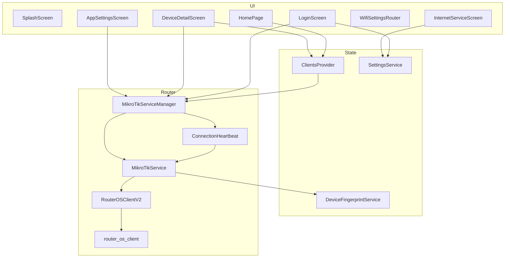
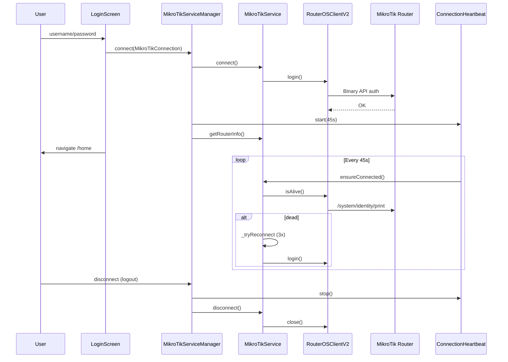

# مستندات کامل پروژه Ariyabod (Internet Management)

> **نسخه برنامه:** 1.0.0+1  
> **توسعه‌دهنده:** Mersad Karimi  
> **پلتفرم:** Flutter (Dart SDK ^3.10.4)  
> **هدف:** مدیریت روتر MikroTik RouterOS — مشاهده دستگاه‌های متصل، مسدودسازی، محدودیت سرعت، قفل اتصال جدید، و پورتال ISP

---

## فهرست مطالب

1. [معرفی و قابلیت‌ها](#1-معرفی-و-قابلیت‌ها)
2. [ساختار پروژه](#2-ساختار-پروژه)
3. [معماری کلی](#3-معماری-کلی)
4. [اتصال به MikroTik](#4-اتصال-به-mikrotik)
5. [لایه RouterOS Client](#5-لایه-routeros-client)
6. [سرویس‌ها](#6-سرویس‌ها)
7. [مدل‌های داده](#7-مدل‌های-داده)
8. [مدیریت State (Provider)](#8-مدیریت-state-provider)
9. [رابط کاربری و صفحات](#9-رابط-کاربری-و-صفحات)
10. [عملیات RouterOS و منطق کسب‌وکار](#10-عملیات-routeros-و-منطق-کسب‌وکار)
11. [تنظیمات وایفای (WiFi Settings)](#11-تنظیمات-وایفای-wifi-settings)
12. [ذخیره‌سازی محلی](#12-ذخیره‌سازی-محلی)
13. [وابستگی‌های خارجی](#13-وابستگی‌های-خارجی)
14. [نکات پیاده‌سازی و محدودیت‌ها](#14-نکات-پیاده‌سازی-و-محدودیت‌ها)

---

## 1. معرفی و قابلیت‌ها

**Ariyabod** یک اپلیکیشن موبایل/دسکتاپ Flutter است که از طریق **RouterOS API** (پورت ۸۷۲۸ یا SSL روی ۸۷۲۹) به روتر MikroTik متصل می‌شود و عملیات مدیریت شبکه را انجام می‌دهد.

### قابلیت‌های اصلی

| قابلیت | توضیح |
|--------|--------|
| ورود به روتر | نام کاربری/رمز + host/port/ssl از تنظیمات |
| لیست دستگاه‌های متصل | بارگذاری تدریجی (Progressive Load): Phase 1 فقط DHCP؛ روی برد CPE بدون ادغام wireless |
| مسدود / رفع مسدود | Firewall Raw + DHCP block + Wireless access-list |
| تأیید / رد دستگاه جدید | تبدیل lease به static یا ban |
| محدودیت سرعت | `rate-limit` روی DHCP lease |
| قفل اتصال جدید | DHCP pool → `static-only` |
| نام نمایشی دستگاه | ویرایش `comment` روی lease |
| تنظیمات وایفای | فرم native API یا WebView پنل CPE بر اساس board/model |
| پورتال ISP | WebView داخلی (تب سرویس انترنت) |
| Auto-login | اعتبارنامه ذخیره‌شده + Splash |
| دو زبانه | فارسی (پیش‌فرض) و انگلیسی |
| تم | روشن / تاریک / سیستم |

---

## 2. ساختار پروژه

```
internet_management/
├── lib/
│   ├── main.dart                 # نقطه ورود، MyApp، MainScaffold، HomePage
│   ├── models/
│   │   ├── mikrotik_connection.dart
│   │   ├── client_info.dart
│   │   └── device_fingerprint.dart
│   ├── services/
│   │   ├── mikrotik_service_manager.dart   # Singleton — نگه‌داری session
│   │   ├── mikrotik_service.dart           # منطق اصلی RouterOS
│   │   ├── routeros_client_v2.dart         # Wrapper پکیج router_os_client
│   │   ├── routeros_client.dart          # پیاده‌سازی legacy (استفاده نمی‌شود)
│   │   ├── connection_heartbeat.dart       # نگه‌داری اتصال
│   │   ├── settings_service.dart
│   │   ├── device_fingerprint_service.dart
│   │   └── network_info_service.dart
│   ├── providers/
│   │   └── clients_provider.dart           # State دستگاه‌ها
│   ├── screens/
│   │   ├── login_screen.dart
│   │   ├── device_detail_screen.dart
│   │   ├── internet_service_screen.dart
│   │   ├── wifi_settings_screen.dart       # WifiSettingsRouter + فرم native
│   │   ├── app_settings_screen.dart
│   │   ├── settings_screen.dart            # (در routes ثبت نشده)
│   │   └── connection_test_screen.dart     # تست dev
│   └── utils/
│       ├── app_localizations.dart
│       ├── wifi_webview_boards.dart        # کاتالوگ ۹ برد CPE → WebView
│       ├── wifi_panel_url_resolver.dart    # URL ثابت پنل: http://10.10.10.2/
│       └── client_display_policy.dart      # فیلتر لیست DHCP / بدون IP
├── assets/                       # فونت Vazir، لوگو
├── android/, ios/, windows/, linux/, macos/, web/
└── pubspec.yaml
```

---

## 3. معماری کلی

### 3.1 لایه‌بندی

```
┌─────────────────────────────────────────────────────────────┐
│  UI Layer                                                    │
│  LoginScreen | HomePage | DeviceDetail | WebView | WiFiSettings | Settings │
└───────────────────────────┬─────────────────────────────────┘
                            │ Provider.of / Navigator
┌───────────────────────────▼─────────────────────────────────┐
│  State Layer                                                 │
│  ClientsProvider (ChangeNotifier)                            │
└───────────────────────────┬─────────────────────────────────┘
                            │
┌───────────────────────────▼─────────────────────────────────┐
│  Session Layer (Singleton)                                   │
│  MikroTikServiceManager + ConnectionHeartbeat                │
└───────────────────────────┬─────────────────────────────────┘
                            │
┌───────────────────────────▼─────────────────────────────────┐
│  Business / API Layer                                        │
│  MikroTikService (_talk, ban, clients, DHCP, ...)           │
└───────────────────────────┬─────────────────────────────────┘
                            │
┌───────────────────────────▼─────────────────────────────────┐
│  Transport Layer                                             │
│  RouterOSClientV2 → package:router_os_client                  │
│  TCP 8728 / SSL 8729 — Binary API v6                         │
└─────────────────────────────────────────────────────────────┘
```

### 3.2 نمودار جریان داده



### 3.3 الگوهای طراحی

| الگو | محل استفاده |
|------|-------------|
| **Singleton** | `MikroTikServiceManager`, `SettingsService`, `NetworkInfoService`, `DeviceFingerprintService` |
| **Provider / ChangeNotifier** | `ClientsProvider` برای لیست دستگاه‌ها |
| **Facade** | `MikroTikServiceManager` روی `MikroTikService` |
| **Command Queue** | `RouterOSClientV2._commandQueue` — سریال‌سازی `talk()` |
| **Marker در comment** | `[Ariyabod BAN]`, `[Ariyabod STATIC]` روی lease و firewall |

---

## 4. اتصال به MikroTik

### 4.1 مدل اتصال — `MikroTikConnection`

```dart
MikroTikConnection(
  host: '192.168.88.1',
  port: 8728,              // پیش‌فرض
  username: 'admin',
  password: '***',
  useSsl: false,
)
```

- اگر `useSsl == true` و `port == 8728` → پورت واقعی **8729** (`actualPort` getter).

### 4.2 فرآیند برقراری اتصال (Login)

```
کاربر → LoginScreen._handleLogin()
  │
  ├─ SettingsService.getAllSettings()  → host, port, useSsl
  ├─ MikroTikConnection(...)
  │
  └─ MikroTikServiceManager.connect(connection)
        │
        ├─ disconnect()                    // بستن session قبلی
        ├─ new MikroTikService()
        ├─ MikroTikService.connect()
        │     ├─ _lastConnection = connection
        │     └─ RouterOSClientV2.login()  → پکیج router_os_client
        ├─ getRouterInfo()                 // cache در manager
        └─ ConnectionHeartbeat.start()     // هر 45 ثانیه
  │
  ├─ SettingsService.setLoginTimestamp()
  └─ Navigator → /home
```

**تنظیم خودکار Host در لاگین:**  
`LoginScreen._autoSetRouterHostFromGateway()` از `NetworkInfoService.getDefaultGatewayOrRouterIp()` استفاده می‌کند و `SettingsService.setHost(gateway)` را می‌زند.

### 4.3 نگه‌داری اتصال (Heartbeat)

کلاس: `lib/services/connection_heartbeat.dart`

| پارامتر | مقدار |
|---------|--------|
| بازه پیش‌فرض | 45 ثانیه |
| healthCheck | `MikroTikService.ensureConnected()` |
| reconnect | همان `ensureConnected()` (درون سرویس reconnect واقعی انجام می‌شود) |
| پس‌زمینه | تایمر متوقف می‌شود |
| بازگشت به foreground | بعد از 1 ثانیه یک tick + راه‌اندازی مجدد periodic |

### 4.4 منطق `ensureConnected` و Reconnect

در `MikroTikService`:

1. اگر `_lastConnection == null` → `false`
2. اگر client وجود ندارد → `_tryReconnect()`
3. `client.isAlive(timeout: 3s)` — دستور `/system/identity/print`
4. اگر مرده بود → `_tryReconnect()`

**`_tryReconnect`:**
- حداکثر **3 تلاش**
- تأخیر: 500ms × شماره تلاش (تلاش 2 → 1000ms، تلاش 3 → 1500ms)
- `_reconnectInProgress` از reconnect موازی جلوگیری می‌کند
- اعتبارنامه از `_lastConnection` (آخرین connect موفق)، نه از UI

**`_talk` (هر دستور API):**
- ابتدا `ensureConnected()`
- timeout پیش‌فرض: **10 ثانیه**
- در `TimeoutException` → `client.invalidateConnection()`

### 4.5 قطع اتصال

| رویداد | عمل |
|--------|-----|
| Logout | `ClientsProvider.clear()`, `disconnect()`, `clearLoginTimestamp()` |
| انقضای 14 روز | `MainScaffold._checkLoginExpiration` |
| `connect()` جدید | `disconnect()` ضمنی قبل از session جدید |

### 4.6 اتصال جدا برای خواندن سرعت

`MikroTikServiceManager.getClientSpeedIsolated(target)`:
- یک `MikroTikService` **موقت** می‌سازد
- connect با timeout 8s
- `getClientSpeed` با timeout 20s
- در `finally` حتماً `disconnect()`

**دلیل:** خواندن سرعت نباید صف دستورات اتصال اصلی را مسدود کند.

---

## 5. لایه RouterOS Client

### 5.1 مسیر فعال (Production)

`RouterOSClientV2` → `package:router_os_client`

| متد | نقش |
|-----|-----|
| `login()` | ساخت `RouterOSClient` و احراز هویت |
| `talk(command)` | ارسال دستور؛ **همه در صف `_commandQueue`** |
| `isAlive()` | `/system/identity/print` با timeout |
| `invalidateConnection()` / `close()` | `_resetState()` — بستن socket و پاک کردن صف |
| `isConnected` | `_loggedIn && _client != null` |

**چرا صف دستور؟**  
Socket RouterOS API ترتیبی است؛ دو `talk()` هم‌زمان پاسخ‌ها را خراب می‌کند و تا timeout معلق می‌ماند.

### 5.2 مسیر Legacy (غیرفعال)

`lib/services/routeros_client.dart` — پیاده‌سازی دستی Binary API v6 + MD5 challenge.  
**هیچ import فعالی از `MikroTikService` به این فایل نیست.**  
فقط `ConnectionTestScreen` می‌تواند مستقیم `MikroTikService` بسازد (همان مسیر v2).

### 5.3 قالب دستور API

دستورات به صورت لیست رشته (مشابه CLI RouterOS):

```dart
[
  '/ip/dhcp-server/lease/print',
  '?=address=192.168.1.10',
  '=.proplist=address,mac-address,comment,dynamic',
]
```

---

## 6. سرویس‌ها

### 6.1 `MikroTikServiceManager` (Singleton)

**فایل:** `lib/services/mikrotik_service_manager.dart`

| State | نوع |
|-------|-----|
| `_service` | `MikroTikService?` |
| `_currentConnection` | `MikroTikConnection?` |
| `_routerInfo` | `Map<String, dynamic>?` |
| `_heartbeat` | `ConnectionHeartbeat?` |

**API عمومی (delegate به service):**  
`connect`, `disconnect`, `autoConnect`, `getRouterInfo`, `loadSecondaryDataIsolated`, `getAllClients`, `getConnectedClients`, `getBannedClients`, `getPhase1BoundDhcpLeases`, `getPhase2ManagedBanRawRules`, `getPhase2ArpTable`, `getPhase2WirelessRegistrations`, `getDeviceIp`, `getDefaultGateway`, `makeClientStatic`, `lockNewConnections`, `unlockNewConnections`, `isNewConnectionsLocked`, `setDhcpLeaseDisplayName`, `getClientSpeedIsolated`, `getWifiSettings`, `setWifiSsid`, `setWifiPassword`, `beginProgressiveLoad`, `endProgressiveLoad`, `ensureSession`

---

### 6.2 `MikroTikService` (منطق اصلی)

**فایل:** `lib/services/mikrotik_service.dart` (~2400+ خط)

#### ثابت‌های مهم

```dart
static const String _appPrefix = 'Ariyabod';
static const String _banMarker = '[Ariyabod BAN]';
static const String _staticMarker = '[Ariyabod STATIC]';
static const String _staticOnlyPool = 'static-only';
static const Duration _apiTimeout = Duration(seconds: 10);
```

#### روترهای بدون Wireless Access List (Ban/Unban)

برای board-nameهایی مثل LHG5، SXT و... مجموعه `_wirelessUnsupportedBoardKeys` — عملیات wireless ban/unban از access-list **صرف‌نظر** می‌شود. این لیست **مستقل** از لیست WebView وایفای است.

#### تشخیص قابلیت Wireless در API

`_supportsWirelessFeatures()`:
- اگر `_routerInfoCache` موجود باشد → `wireless-features-enabled = !_isWirelessUnsupportedRouter(...)`
- در **Progressive Load** و بدون cache روتر → **`false`** (wireless خوانده نمی‌شود تا board مشخص شود)
- در `ensureConnected` هنگام progressive (بدون force health check) → health check رد می‌شود تا صف سبک بماند

#### متدهای WiFi (فرم native)

| متد | RouterOS |
|-----|----------|
| `getWifiSettings({interfaceId})` | `/interface/wireless/print` + `/interface/wireless/security-profiles/print` |
| `setWifiSsid(...)` | `/interface/wireless/set` — `ssid`, `hide-ssid` |
| `setWifiPassword(...)` | `/interface/wireless/security-profiles/set` — `wpa2-pre-shared-key` و `wpa-pre-shared-key` |

رمز وایفای **هرگز** در SharedPreferences ذخیره نمی‌شود.

#### متدهای عمومی (خلاصه)

| دسته | متدها |
|------|--------|
| اتصال | `connect`, `disconnect`, `ensureConnected`, `isConnected` |
| کلاینت‌ها | `getAllClients`, `getClientsDetailed`, `getConnectedClients` |
| Ban/Unban | `banClient`, `unbanClient`, `banClientWithFingerprint`, `unbanClientWithFingerprint`, `getBannedClients` |
| سرعت | `setClientSpeed`, `getClientSpeed`, `removeClientSpeed` (+ legacy aliases) |
| DHCP | `makeClientStatic`, `setDhcpLeaseDisplayName`, `lockNewConnections`, `unlockNewConnections`, `isNewConnectionsLocked` |
| شبکه/روتر | `getDeviceIp`, `getDefaultGateway`, `getDefaultGatewayOrRouterIp`, `getRouterInfo`, `getRouterInfoSecondary`, `checkIp` |
| Progressive | `getPhase1BoundDhcpLeases`, `getPhase2ManagedBanRawRules`, `getPhase2ArpTable`, `getPhase2WirelessRegistrations` |
| WiFi | `getWifiSettings`, `setWifiSsid`, `setWifiPassword` |
| Fingerprint | `checkAndBanBannedDevices` (از `_runBackgroundTasks` در Provider) |

---

### 6.3 `SettingsService` (Singleton)

**فایل:** `lib/services/settings_service.dart`  
**ذخیره:** SharedPreferences + cache در حافظه

| کلید | پیش‌فرض | کاربرد |
|------|---------|--------|
| `mikrotik_host` | `192.168.88.1` | IP روتر |
| `mikrotik_port` | `8728` | پورت API |
| `mikrotik_use_ssl` | `false` | SSL |
| `internet_service_url` | `http://user.ariyabod.af/users` | WebView |
| `login_timestamp` | — | انقضای 14 روزه |
| `app_language` | `fa` | زبان |
| `app_theme_mode` | `system` | تم |

---

### 6.4 `NetworkInfoService` (Singleton)

**فایل:** `lib/services/network_info_service.dart`

| متد | منبع داده |
|-----|-----------|
| `getDeviceIPv4Address()` | `NetworkInterface.list` — اولین IP خصوصی |
| `getDefaultGateway()` | RouterOS اگر متصل باشد |
| `getDefaultGatewayOrRouterIp()` | 1) RouterOS 2) حدس `x.y.z.1` 3) host از Settings |

---

### 6.5 `DeviceFingerprintService` (Singleton)

**فایل:** `lib/services/device_fingerprint_service.dart`  
**کلید:** `banned_device_fingerprints` (JSON در SharedPreferences)

| متد | کار |
|-----|-----|
| `saveBannedFingerprint` | افزودن اگر `matches` تکراری نباشد |
| `removeBannedFingerprint` | حذف همه مطابق‌ها |
| `getBannedFingerprints` | لیست |
| `isDeviceBanned` / `findBannedFingerprint` | جستجو |

---

### 6.6 `ConnectionHeartbeat`

جزئیات در [بخش 4.3](#43-نگهداری-اتصال-heartbeat).

### 6.7 ابزارهای کمکی (`lib/utils/`)

| فایل | نقش |
|------|-----|
| `app_localizations.dart` | i18n فارسی/انگلیسی |
| `wifi_webview_boards.dart` | کاتالوگ دقیق ۹ برد CPE؛ `isWifiWebViewBoard()` |
| `wifi_panel_url_resolver.dart` | ثابت `cpeWifiPanelUrl = http://10.10.10.2/` |
| `client_display_policy.dart` | نمایش فقط DHCP+IP؛ skip wireless روی CPE؛ مسدود عملیات بدون IP |

---

## 7. مدل‌های داده

### 7.1 `ClientInfo`

**فایل:** `lib/models/client_info.dart`

نمای یک دستگاه یکپارچه از منابع مختلف:

| فیلد | معنی |
|------|------|
| `type` | `hotspot`, `wireless`, `dhcp`, `ppp` |
| `source` | مثلاً `wireless_registration`, `dhcp_lease` |
| `ipAddress`, `macAddress`, `hostName` | شناسه‌های شبکه |
| `isStaticLease` | `true` = static، `false` = dynamic |
| `ssid`, `signalStrength` | wireless |
| `rawData` | Map خام RouterOS |

`fromMap` / `toMap` با کلیدهای snake_case برای API داخلی.

---

### 7.2 `DeviceFingerprint`

**فایل:** `lib/models/device_fingerprint.dart`

شناسایی پایدار دستگاه پس از تغییر IP/MAC:

| جزء | اولویت |
|-----|--------|
| hostname | بالاترین |
| deviceType | از hostname (iPhone, Samsung, ...) |
| macVendor | 3 بایت اول MAC |
| ssid | wireless |

- `fingerprintId` = join با `|`
- `matches(other)` — hostname یکسان **یا** (vendor + deviceType + ssid) یکسان

---

### 7.3 ساختارهای Map (بدون کلاس جدا)

**اطلاعات روتر** (`getRouterInfo`):
- `uptime`, `version`, `board-name`, `platform`, `wireless-features-enabled`, ...

**ردیف banned** (`getBannedClients`):
- `address`, `mac_address`, `chains`, `rule_ids`, `host_name`, `dhcp_blocked`, `wireless_blocked`

**پاسخ لیست کلاینت:**
```json
{
  "status": "success",
  "total_count": 5,
  "clients": [ /* ClientInfo.toMap() */ ]
}
```

---

## 8. مدیریت State (Provider)

### 8.1 `ClientsProvider`

**فایل:** `lib/providers/clients_provider.dart`  
**ثبت:** `ChangeNotifierProvider` در `MyApp`

#### State

| متغیر | توضیح |
|-------|--------|
| `_clients` | لیست متصل (فیلتر شده از banned) |
| `_bannedClients` | لیست مسدود |
| `_deviceIp` | IP دستگاه کاربر |
| `_routerInfo` | اطلاعات روتر |
| `_isNewConnectionsLocked` | وضعیت قفل DHCP |
| `_isLoading`, `_isRefreshing`, `_errorMessage` | UI |
| `_approvalActionsInProgress` | جلوگیری از دوبار کلیک تأیید/رد |

#### Timeoutهای بارگذاری

| عملیات | Timeout |
|--------|---------|
| device IP | 10s |
| auto static | 10s |
| router info | 8s |
| lock status | 8s |
| banned list | 10s |
| connected clients | 12s |

#### بارگذاری تدریجی — `_runProgressiveLoad()`

| Phase | متد | محتوا |
|-------|-----|--------|
| **1** | `_loadPhase1DeviceList` | فقط DHCP leaseهای `bound` → لیست اولیه سریع |
| **2** | `_loadPhase2StatusEnrichment` | قوانین ban، تکمیل IP از ARP، wireless (در صورت مجاز) |
| **3** | `_loadPhase3SecondaryData` | IP دستگاه، `routerInfo`، وضعیت قفل DHCP (اتصال isolated) |
| پس‌زمینه | `_runBackgroundTasks` | auto-static، `checkAndBanBannedDevices` |

در Phase 2، `beginProgressiveLoad()` / `endProgressiveLoad()` روی سرویس فعال است تا health check اضافی صف را سنگین نکند.

#### فیلتر نمایش لیست — `ClientDisplayPolicy`

**فایل:** `lib/utils/client_display_policy.dart`

| قانون | توضیح |
|-------|--------|
| `shouldShowInConnectedList` | فقط دستگاه با **IP معتبر** (نه `0.0.0.0` / خالی) |
| `shouldSkipWirelessEnrichment` | روی برد CPE (کاتالوگ `wifi_webview_boards`) یا `wireless-features-enabled == false` |
| `shouldAllowDeviceActions` | ban/سرعت/نام DHCP نیاز به IP دارد |

دستگاه‌های wireless با **فقط MAC** (بدون IP) — معمول روی LHG/SXT — در لیست نمایش داده **نمی‌شوند**.

#### `initialize()` / `refresh()`

1. `_runProgressiveLoad()` — مسیر اصلی Home پس از login
2. `refresh()` — dedupe با `_activeRefreshFuture`؛ می‌تواند `loadClients()` کامل (12s) را هم صدا بزند

#### مرتب‌سازی نمایش

1. دستگاه فعلی (IP کاربر) اول
2. static قبل از dynamic
3. سپس بر اساس IP

#### عملیات کلیدی

| متد | رفتار |
|-----|--------|
| `banClient` | fingerprint + fallback ban؛ ممنوع برای دستگاه فعلی |
| `banClientInstant` | حذف فوری از UI + ban در پس‌زمینه |
| `unbanClient` | از لیست banned حذف + API |
| `approveDevice` | `makeClientStatic` + علامت static در UI |
| `rejectDevice` | static سپس ban |
| `toggleNewConnectionsLock` | lock/unlock pool |
| `updateClientLeaseDisplayName` | نام روی lease |
| `setClientSpeed` / `removeClientSpeed` | + cache محلی SharedPreferences |
| `clear()` | logout — پاک کردن state |

#### دستگاه «در انتظار تأیید»

`isDevicePendingApproval`:
- نه دستگاه فعلی
- نه static
- دارای IP و (dynamic یا MAC)

---

## 9. رابط کاربری و صفحات

### 9.1 مسیرها (`main.dart` → `MyApp`)

| Route | Widget |
|-------|--------|
| `/` | `SplashScreen` (auto-login) |
| `/login` | `LoginScreen` |
| `/home` | `MainScaffold` |
| `/test` | `ConnectionTestScreen` |
| `/device-detail` | `DeviceDetailScreen` (arguments) |
| `/wifi-settings` | `WifiSettingsRouter` |
| `/wifi-webview` | `InternetServiceScreen` — `fixedUrl: http://10.10.10.2/` |

### 9.2 `MyApp`

- بارگذاری زبان و تم از `SettingsService`
- `Provider<ClientsProvider>`
- `RouteObserver` برای refresh هنگام بازگشت از detail
- لاگ شبکه در startup

### 9.3 `MainScaffold`

`IndexedStack` با سه تب:
1. **HomePage** — مدیریت دستگاه‌ها
2. **InternetServiceScreen** — WebView
3. **AppSettingsScreen** — زبان، تم، خروج

بررسی انقضای لاگین 14 روزه.

### 9.4 `HomePage`

- بنر اتصال (identity روتر، کاربر، SSL، IP دستگاه)
- سوئیچ **قفل اتصال جدید**
- تب‌های Connected / Banned
- Pull-to-refresh
- کارت دستگاه: نوع، static/dynamic، تأیید/رد، navigation به detail
- `RouteAware` — refresh پس از pop از detail

### 9.5 `DeviceDetailScreen`

- ویرایش نام نمایشی lease
- محدودیت سرعت (sheet) + `getClientSpeedIsolated`
- ban/unban (با fingerprint)
- مسدود برای pending approval
- اگر `ClientDisplayPolicy.shouldAllowDeviceActions(device) == false` (بدون IP): **بدون دکمه عملیاتی** — فقط اطلاعات

### 9.6 `InternetServiceScreen`

دو حالت:
1. **تب سرویس انترنت** — URL از `SettingsService.getServiceUrl()` (پیش‌فرض پورتال ISP)
2. **پنل وایفای CPE** — route `/wifi-webview` با `fixedUrl` ثابت `http://10.10.10.2/`

`InAppWebView` — navigation، reload؛ تغییر URL فقط وقتی `allowUrlChange: true`.

### 9.7 `wifi_settings_screen.dart`

| Widget | نقش |
|--------|-----|
| `WifiSettingsRouter` | تشخیص board از `ClientsProvider.routerInfo`؛ مسیریابی |
| `_WifiLoadingPlaceholder` | انتظار تا `routerInfo` (حداکثر ۱۰ ثانیه) + `loadRouterInfo()` |
| `WifiNativeSettingsScreen` | فرم SSID / رمز / Hide SSID برای روترهای غیر-CPE |
| `_WifiWebViewRedirect` | `pushReplacementNamed('/wifi-webview')` |

ورود از **AppSettingsScreen** → `Navigator.pushNamed('/wifi-settings')`.

### 9.8 `AppSettingsScreen`

- زبان، تم، خروج
- آیتم **تنظیمات وایفای** → `/wifi-settings`

### 9.9 `LoginScreen`

- فقط username/password (host از Settings + auto gateway)
- اتصال از طریق Manager

### 9.10 صفحات کم‌استفاده / dev

- `SettingsScreen` — ویرایش host/port/ssl (**در routes نیست**)
- `ConnectionTestScreen` — تست مستقیم `MikroTikService`

---

## 10. عملیات RouterOS و منطق کسب‌وکار

### 10.1 جمع‌آوری دستگاه‌های متصل

#### مسیر Progressive (Home — پیش‌فرض)

```
Phase 1: DHCP bound leases فقط
Phase 2: ban flags + ARP IP fill + wireless (اگر shouldSkipWirelessEnrichment == false)
Phase 3: routerInfo + deviceIp + lock
→ فیلتر: banned + ClientDisplayPolicy (فقط با IP)
```

#### مسیر یک‌جا — `getConnectedClients()`

```
1. DHCP leases (status=bound) → dictionary بر اساس MAC
2. ARP table → تکمیل IP
3. Wireless registration-table (فقط اگر _supportsWirelessFeatures)
   → ردیف‌های بدون IP رد می‌شوند
4. DHCP leases باقی‌مانده (غیر تکراری با wireless)
5. Hotspot active (غیر تکراری)
```

نام نمایشی: از `comment` lease (بدون markerهای BAN/STATIC) یا `host-name`.

---

### 10.2 مسدودسازی — `banClient`

سه لایه (هر کدام با comment مدیریت‌شده `[Ariyabod BAN]`):

| لایه | RouterOS | شرط |
|------|----------|-----|
| Firewall Raw | `/ip/firewall/raw` — chain prerouting, action drop | IP و/یا MAC |
| DHCP | `block-access=yes` روی lease | اگر MAC موجود |
| Wireless | `/interface/wireless/access-list` deny | اگر MAC و روتر پشتیبانی کند |

اگر MAC نباشد → `_findMacForIp` از DHCP یا ARP.

**با fingerprint:**  
`banClientWithFingerprint` → ذخیره در `DeviceFingerprintService` + `banClient` با comment شامل `fingerprintId`.

---

### 10.3 رفع مسدود — `unbanClient`

1. جمع‌آوری ruleهای raw با comment مدیریت‌شده (IP/MAC)
2. گروه‌بندی با `_managedBanCommentGroupKey` (حذف پسوند `- IP|MAC|Wireless`)
3. حذف همه ruleهای همان گروه
4. `_setDhcpBlockForMac(block: false)`
5. `_removeManagedAccessRules` برای wireless

---

### 10.4 لیست مسدود — `getBannedClients`

ترکیب:
- Raw rules با action drop و comment مدیریت‌شده
- وضعیت DHCP block
- wireless deny rules

---

### 10.5 محدودیت سرعت

روی **DHCP lease** فیلد `rate-limit` (فرمت MikroTik مثل `10M/10M`).

- `setClientSpeed(target, maxLimit)`
- `getClientSpeed(target)` — خواندن از lease
- `removeClientSpeed` — پاک کردن rate-limit

---

### 10.6 Static lease — `makeClientStatic`

- جستجوی lease با IP/MAC
- اگر dynamic: `/ip/dhcp-server/lease/make-static`
- یا `lease add` در صورت نیاز
- marker `[Ariyabod STATIC]` در comment

**Auto-static:** `ClientsProvider._ensureCurrentDeviceStatic` — IP دستگاه کاربر را یک‌بار static می‌کند.

---

### 10.7 قفل اتصال جدید

| عمل | RouterOS |
|-----|----------|
| `lockNewConnections` | DHCP server → `address-pool=static-only` |
| `unlockNewConnections` | بازگردانی pool قبلی (غیر static-only) |
| `isNewConnectionsLocked` | بررسی pool فعلی |

دستگاه‌های dynamic جدید IP نمی‌گیرند تا admin آن‌ها را static/تأیید کند.

---

### 10.8 نام نمایشی — `setDhcpLeaseDisplayName`

- به‌روزرسانی `comment` lease
- حفظ markerهای `[Ariyabod BAN]` و `[Ariyabod STATIC]` در comment

---

### 10.9 IP دستگاه کاربر — `getDeviceIp`

ترکیب:
1. IP محلی از `NetworkInterface`
2. تطبیق با ARP/DHCP روی روتر
3. همبستگی با gateway/subnet

---

### 10.10 اطلاعات روتر — `getRouterInfo`

دستورات نمونه:
- `/system/resource/print`
- `/system/routerboard/print`
- `/system/identity/print`

Cache در `_routerInfoCache` تا reconnect بعدی.

---

## 11. تنظیمات وایفای (WiFi Settings)

### 11.1 تصمیم WebView در مقابل فرم Native

**فایل تشخیص:** `lib/utils/wifi_webview_boards.dart` — تابع `isWifiWebViewBoard(routerInfo)`

فقط اگر **Model** (یا در نبود model، **Type/board-name**) با یکی از ۹ ردیف زیر تطبیق کند → WebView.  
این لیست **جدا** از `_wirelessUnsupportedBoardKeys` (ban) است.

| Type | Model |
|------|-------|
| LHG5 / RBLHG-5nD | RBLHG-5nD |
| SXTsq lite5 | RBSXTsq5nD |
| SXT Lite5 | SXT 5nD r2 |
| LHG5 ac | RBLHGG-5acD |
| QRT 5 | 911G-5HPnD |
| QRT 5 ac | 911G-5HPacD |
| LHG-5 XL | RBLHGG-5acD |
| SEXTANT 5 | 911G-5HPnD |
| SXT 6 | RBSXTG-6HPnD |

> روی این بردها `board-name` API اغلب `LHG5` است و `model` برابر `RBLHG-5nD` — تطبیق بر اساس نرمال‌سازی alphanumeric انجام می‌شود.

### 11.2 WebView — پنل CPE

- **URL ثابت:** `http://10.10.10.2/` (`WifiPanelUrlResolver.cpeWifiPanelUrl`)
- **بدون fallback** به IP روتر یا `10.10.10.1`
- Route: `/wifi-webview` → `InternetServiceScreen(fixedUrl: ..., allowUrlChange: false)`

### 11.3 فرم Native — سایر روترها

`WifiNativeSettingsScreen`:

1. **خواندن:** `getWifiSettings()` — اولین interface غیرغیرفعال (یا انتخاب از dropdown اگر چند wlan)
2. **نمایش:** SSID، رمز (اختیاری — خالی = بدون تغییر)، Hide SSID
3. **ذخیره:** دیالوگ تأیید (`showDialog`) سپس `setWifiSsid` / `setWifiPassword`
4. Timeout هر فراخوانی: 10 ثانیه
5. لاگ: پیشوند `[WIFI_SETTINGS]`

### 11.4 کلیدهای i18n

در `AppLocalizations`: `wifiSettings`, `wifiNameLabel`, `wifiPasswordLabel`, `wifiSave`, `wifiLoading`, `wifiNoInterface`, ...

---

## 12. ذخیره‌سازی محلی

| محل | داده |
|-----|------|
| SharedPreferences | host, port, ssl, service URL, login time, language, theme |
| SharedPreferences | `banned_device_fingerprints` (JSON) |
| SharedPreferences | cache سرعت per IP (در DeviceDetail / Provider) |
| حافظه (Singleton) | session RouterOS، routerInfo cache، ClientsProvider state |

**انقضای session اپ:** 14 روز از `login_timestamp` — مستقل از RouterOS.

---

## 13. وابستگی‌های خارجی

| پکیج | نسخه | نقش |
|------|------|-----|
| `router_os_client` | ^2.0.0 | اتصال Binary API |
| `provider` | ^6.1.1 | State management |
| `shared_preferences` | ^2.2.2 | Persistence تنظیمات |
| `flutter_secure_storage` | — | ذخیره امن username/password |
| `flutter_inappwebview` | ^6.1.0+11 | WebView ISP |
| `crypto` | ^3.0.5 | فقط legacy client |
| `flutter_localizations` | SDK | i18n framework |

---

## 14. نکات پیاده‌سازی و محدودیت‌ها

### 14.1 نقاط قوت معماری

- **یک session سراسری** از طریق Manager
- **صف دستور** در v2 — پایداری API
- **Heartbeat + ensureConnected** — مقاومت در برابر قطع idle
- **اتصال جدا برای speed** — UX بهتر در detail
- **Markerهای comment** — تشخیص rule/leaseهای ایجادشده توسط اپ
- **Fingerprint محلی** — ban پایدارتر از IP/MAC

### 14.2 محدودیت‌ها و شکاف‌ها

| موضوع | وضعیت |
|-------|--------|
| `SettingsScreen` | وجود دارد؛ در navigation ثبت نشده |
| `getAllClients` | موجود؛ Home از Progressive Load + گاهی `getConnectedClients` |
| `routeros_client.dart` | legacy؛ مسیر production از v2 |
| Host/Port در UI | عمدتاً auto gateway + defaults؛ ویرایش دستی محدود |
| Reconnect | فقط با credential ذخیره‌شده در service؛ بدون re-prompt |
| Wireless ban | روی boardهای LHG/SXT و... غیرفعال (`_wirelessUnsupportedBoardKeys`) |
| لیست متصل روی CPE | فقط DHCP با IP؛ wireless registration نمایش داده نمی‌شود |
| پنل WebView CPE | فقط `http://10.10.10.2/` — نیاز به دسترسی شبکه به آن subnet |
| Ban دستگاه فعلی | در Provider مسدود است |
| رمز وایفای | فقط در حافظه موقت UI؛ persist نمی‌شود |

### 14.3 پیش‌نیازهای روتر

- API RouterOS فعال (پورت 8728/8729)
- کاربر با دسترسی مناسب (DHCP, firewall raw, wireless در صورت نیاز)
- برای قفل اتصال: DHCP server با address-pool قابل تغییر

### 14.4 لاگ‌های دیباگ

پیشوندها در console:
- `[ROUTEROS_QUEUE]` — صف دستور
- `[SERVICE]` — connect/reconnect
- `[HEARTBEAT]` — health tick
- `[PROGRESSIVE_LOAD]` — Phase 1/2/3
- `[CLIENT_LIST]` — فیلتر wireless / CPE
- `[WIFI_SETTINGS]` — تشخیص board و API وایفای
- `[LOGIN]` / `[APP_STARTUP]` / `[AUTO_LOGIN]` — شبکه و gateway

---

## پیوست: نمودار چرخه عمر Session



---

## پیوست: جدول نگاشت فایل → مسئولیت

| فایل | مسئولیت اصلی |
|------|----------------|
| `main.dart` | Bootstrap، theme/locale، routing، Home UI |
| `mikrotik_service_manager.dart` | Session singleton، heartbeat |
| `mikrotik_service.dart` | تمام منطق RouterOS |
| `routeros_client_v2.dart` | Transport + command queue |
| `connection_heartbeat.dart` | Keep-alive دوره‌ای |
| `clients_provider.dart` | State UI دستگاه‌ها |
| `settings_service.dart` | تنظیمات persistent |
| `device_fingerprint_service.dart` | Ban list محلی |
| `network_info_service.dart` | IP/gateway دستگاه |
| `login_screen.dart` | احراز هویت RouterOS |
| `device_detail_screen.dart` | عملیات per-device |
| `internet_service_screen.dart` | WebView ISP + پنل CPE |
| `wifi_settings_screen.dart` | مسیریابی و فرم وایفای |
| `wifi_webview_boards.dart` | کاتالوگ ۹ برد → WebView |
| `wifi_panel_url_resolver.dart` | URL ثابت `10.10.10.2` |
| `client_display_policy.dart` | فیلتر لیست و دکمه‌های detail |
| `app_settings_screen.dart` | تنظیمات اپ + ورود وایفای |

---

*این مستند بر اساس بررسی سورس‌کد پروژه در مسیر `lib/` تهیه شده است. برای به‌روزرسانی پس از تغییرات معماری، بخش‌های 4، 6، 8، 10 و 11 را اولویت دهید.*
